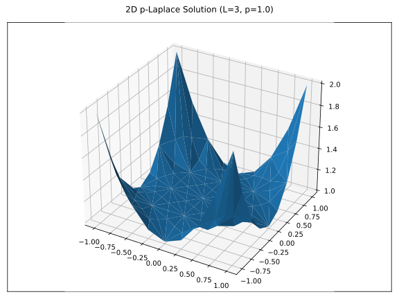

# MultiGridBarrierPETSc.jl

**A Julia package that bridges MultiGridBarrier.jl and SafePETSc.jl for distributed multigrid barrier computations.**

## Overview

MultiGridBarrierPETSc.jl extends the MultiGridBarrier.jl package to work with PETSc's distributed Mat and Vec types through SafePETSc.jl. This enables efficient parallel computation of multigrid barrier methods across multiple MPI ranks.

## Key Features

- **1D, 2D, and 3D Support**: Full support for 1D elements, 2D triangular, and 3D hexahedral finite elements
- **Seamless Integration**: Drop-in replacement for MultiGridBarrier's native types
- **Distributed Computing**: Leverage PETSc's distributed linear algebra for large-scale problems
- **Type Conversion**: Easy conversion between native Julia arrays and PETSc distributed types
- **MPI-Aware**: All operations correctly handle MPI collective requirements
- **MUMPS Solver**: Automatically configures MUMPS direct solver for accurate Newton iterations

## Quick Example

Solve a 2D p-Laplace problem with distributed PETSc types. Save this code to `example.jl`:

```julia
using MPI
using MultiGridBarrierPETSc
using MultiGridBarrier
using PyPlot
MultiGridBarrierPETSc.Init()

# Solve with PETSc distributed types (L=3 refinement levels)
sol_petsc = fem2d_petsc_solve(Float64; L=3, p=1.0, verbose=false)

# Convert to native types for visualization
sol_native = petsc_to_native(sol_petsc)

# Only rank 0 creates the plot
rank = MPI.Comm_rank(MPI.COMM_WORLD)
if rank == 0
    plot(sol_native)
    savefig("solution.png")
    println("Plot saved to solution.png")
end
```

**Run with 4 MPI ranks using Julia's MPI launcher:**

```bash
julia -e 'using MPI; run(`$(MPI.mpiexec()) -n 4 $(Base.julia_cmd()) example.jl`)'
```

This command uses `MPI.mpiexec()` to get the correct MPI launcher configured for your Julia installation, avoiding compatibility issues with system `mpiexec`. Add `--project` or other Julia options as needed for your environment.



The plot above shows the solution to a 2D p-Laplace problem computed using distributed PETSc matrices across 4 MPI ranks, then converted back to native Julia types for visualization.

## Documentation Contents

```@contents
Pages = ["installation.md", "guide.md", "api.md"]
Depth = 2
```

## Package Ecosystem

This package is part of a larger ecosystem:

- **[MultiGridBarrier.jl](https://github.com/sloisel/MultiGridBarrier.jl)**: Core multigrid barrier method implementation (2D)
- **[MultiGridBarrier3d.jl](https://github.com/sloisel/MultiGridBarrier3d.jl)**: 3D hexahedral finite element extension
- **[SafePETSc.jl](https://github.com/sloisel/SafePETSc.jl)**: Safe PETSc bindings with automatic memory management
- **MPI.jl**: Julia MPI bindings for distributed computing

## Requirements

- Julia 1.10 or later (LTS version)
- MPI installation (OpenMPI, MPICH, or Intel MPI)
- PETSc with MUMPS support (automatically configured)
- At least 4 MPI ranks recommended for testing

## Citation

If you use this package in your research, please cite:

```bibtex
@software{multigridbarrierpetsc,
  author = {Loisel, Sebastien},
  title = {MultiGridBarrierPETSc.jl: Distributed Multigrid Barrier Methods},
  year = {2024},
  url = {https://github.com/sloisel/MultiGridBarrierPETSc.jl}
}
```

## License

This package is licensed under the MIT License.
